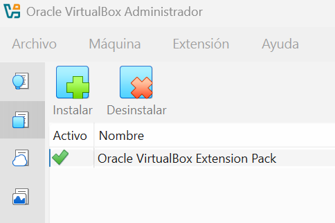
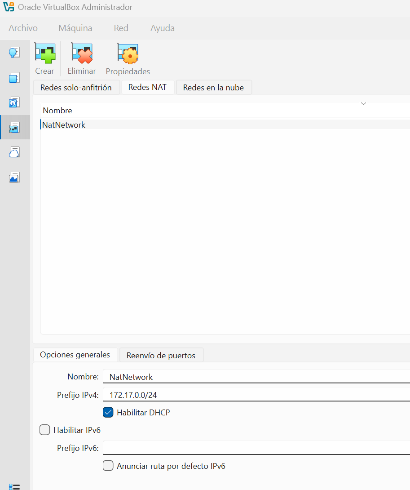
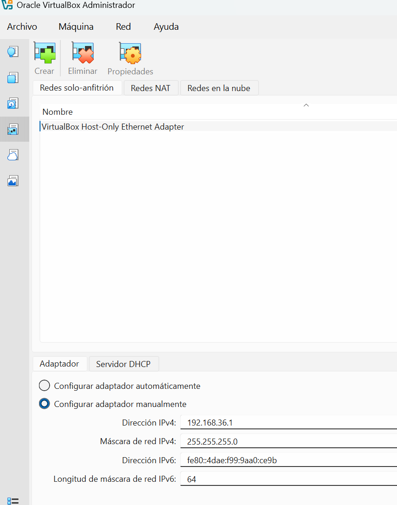

# Configuración de VirtualBox

[TOC]

> Revisamos que este instalado el `ExtensionPack`



> Trabajaremos siempre en modo **Expert**

## Configurar nuestra Red Nat

Trabajaremos con el adaptador de red en modo Red NAT para para poder conectar dos máquina virtuales entre ellas.



```html
<div style="page-break-after: always;"></div>
```

## Configurar la red solo-anfitrión

Esta red nos sirve para poder conectar la máquina anfitrióon, es decir nuestra maquina REAL con una máquina virtual.




