# Manual de Linux

[TOC]

## Capítulo 2

### 2.1 Comandos `Pwd, cd, ls, dir`

- Comando

  ```bash
  `pwd`
  ```

​	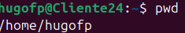

- Comando 

  ```bash
  cd
  ```

  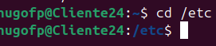

- Comando 

  ```bash
  ls
  ```

  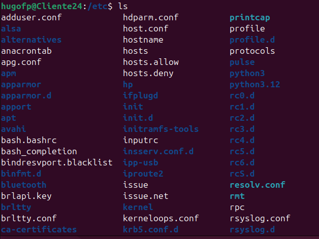

- Comando 

  ```bash
  mkdir
  ```

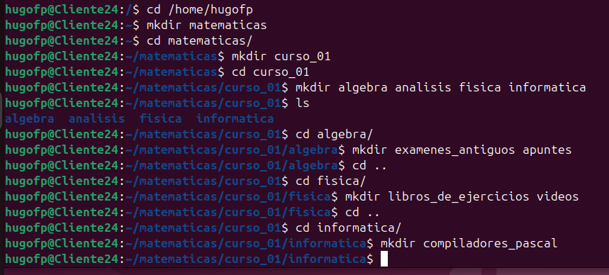

### 2.2 Visualización de ficheros `cat, more, less, head, tail`


- Comando

```bash
cat
```

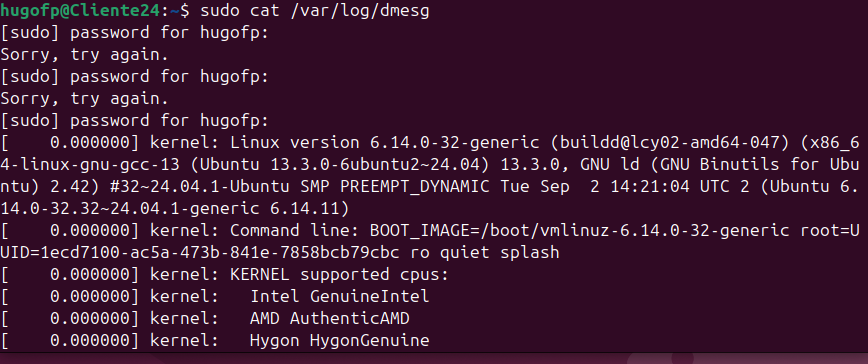

- Comando 

  ```bash
  $more
  ```

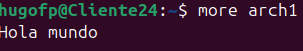

- Comando 

  ```bash
  $less
  ```

  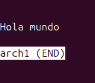

- Comando 

  ```bash
  $head
  ```

  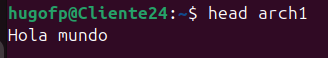

- Comando 

  ```bash
  $tail
  ```

  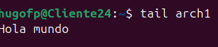

### 2.3 Edición de fichros `touch, vi, ee, mcedit`


- Comando 

  ```bash
  touch
  ```

  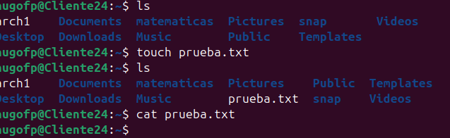

- Comando 

  ```bash
  $ee
  ```

  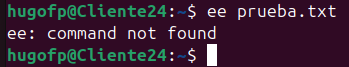

- Comando 

  ```bash
  vi
  ```

  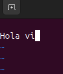

- Comando 

  ```bash
  $nano
  ```

  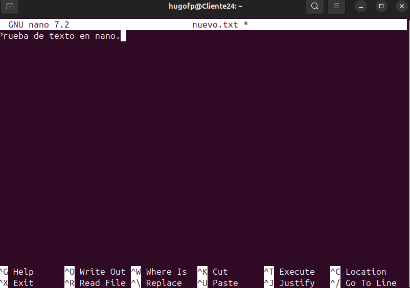

### 2.4 Resumen Capitulo 2 

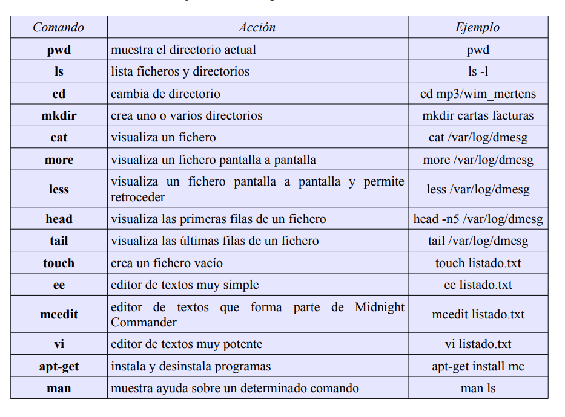


## Capítulo 3 

### 3.1 Caracteres comodín

Para mostrar cada uno de los ficheros que comienzan por docu seguido de un número del uno al seis se puede utilizar un patrón:

```bash
cat fich[1-6]
```

Si se quiere mostrar simplemente el contenido de todos los ficheros que comienzan por fich se puede hacer:

```bash
cat fich*
```

Por ejemplo, para mostrar todos los ficheros que empiezan por la letra a y terminan por la letras dentro del directorio /usr/bin:

```bash
ls /usr/bin/a*s
```

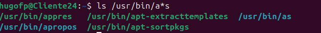

El símbolo “?” representa un carácter cualquiera. De esta forma, la siguiente sentencia muestra todos los ficheros del directorio /usr/bin cuyo nombre comienza por g, sigue cualquier carácter, a continuación sigue una o y termina con cualquier cadena de caracteres incluida la cadena vacía:

```bash
ls /usr/bin/g?o*
```

### 3.2 Copia y borrado de ficheros `cp, mv, rm`

- Comando 

  ```bash
  cp
  ```

  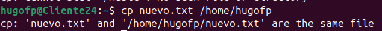

- Comando 

  ```bash
  mv
  ```

  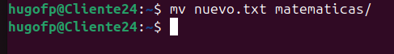

- Comando 

  ```bash
  rm
  ```

  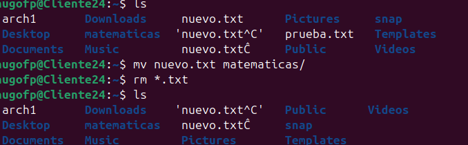

### 3.3 Copia y borrado de diractorios

Mismo uso de los comandos cambiando la sintaxis del tipo de objeto con el que se interactua.

### 3.4 Resumen del cápitulo 3 

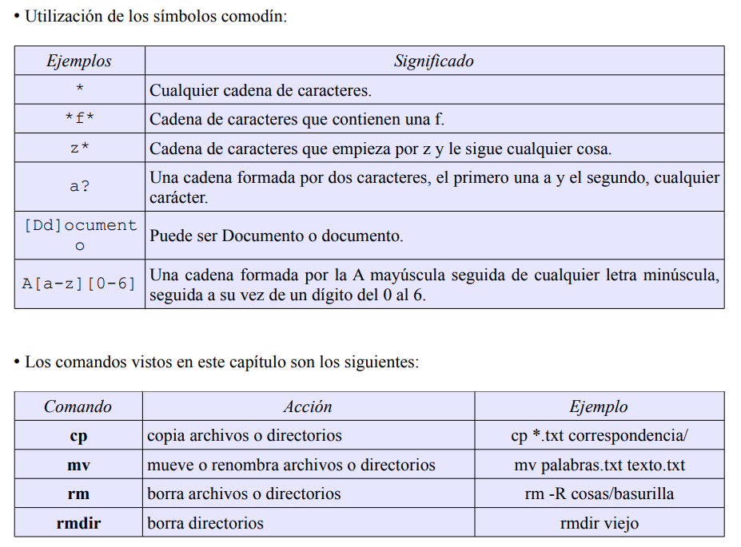

## Cápitulo 4


### 4.1 ¿POR QUÉ EXISTEN GRUPOS, USUARIOS Y PERMISOS?

Vimos en un capítulo anterior que los ficheros deben estar organizados en directorios (carpetas) con el fin de tenerlos ordenados y poder localizarlos convenientemente.

### 4.2 ¿QUÉ ES EL SUPERUSUARIO?

El superusuario, administrador del sistema o simplemente el root, es un usuario especial que tiene privilegios para cambiar la configuración, borrar y crear ficheros en cualquier directorio, crear nuevos grupos y usuarios, etc.

### 4.3 PERMISOS

La información sobre grupos, usuarios y permisos se puede obtener mediante el comando ls junto con la opción -l. Vamos a ver los permisos que tiene establecidos el fichero whatis que se encuentra en el directorio /usr/bin.

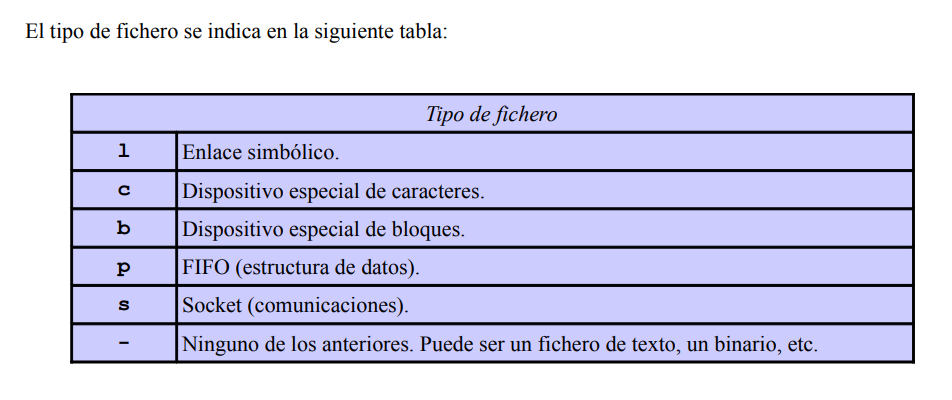

### 4.4 ¿QUIÉNES SOMOS? (whoami, groups)

Antes de empezar a crear usuarios, crear grupos y cambiar permisos, debemos saber quiénes somos y a qué grupo o grupos pertenecemos. Aunque, en principio, entremos en el sistema como un determinado usuario, podemos utilizar su para ejecutar comandos como otro usuario distinto, siempre y cuando sepamos la contraseña de ese otro usuario.

 

```bash
$ whoami luisjose $ su alumno Contraseña: $ whoami alumno
```

 Para volver a ser el usuario original basta con utilizar

```bash
 exit
```

Con el comando `groups` se puede ver a qué grupo pertenecemos

```bash
luisjose@luisjose-xps1330:~$ groups luisjose adm dialout cdrom floppy audio dip video plugdev scanner lpadmin admin netdev powerdev sambashare 
```

### 4.5 GESTIÓN DE GRUPOS (groupadd, groupdel, groupmod)

Los comandos `groupadd`, `groupdel` y `groupmod` permiten crear, borrar y modificar grupos respectivamente. 

Vamos a crear los grupos oficina_malaga, oficina_jaen y oficina_madrid

```bash
$ groupadd oficina_malaga groupadd: incapaz de bloquear el fichero de grupos $ sudo groupadd oficina_malaga $ sudo groupadd oficina_jaen $ sudo groupadd oficina_madrit 
```

### 4.6 GESTIÓN DE USUARIOS (adduser, userdel, usermod)

La gestión de usuarios, al igual que la de grupos, exige que los comandos se ejecuten con los privilegios del administrador del sistema. Se puede escribir sudo antes de cada comando, o se puede hacer lo siguiente:

```bash
$ sudo bash
```

Es necesario dar de alta a dos usuarios para el grupo oficina_malaga y uno para oficina_madrid. Habrá un cuarto usuario que estará yendo y viniendo de una oficina a otra, por tanto se le dará de alta en las dos.

```bash
# adduser pedro --ingroup oficina_malaga # adduser ana --ingroup oficina_malaga # adduser berta --ingroup oficina_madrid # adduser laura --ingroup oficina_malaga # adduser laura oficina_madrid 
```

### 4.7 CAMBIO DE GRUPO Y DE DUEÑO (chown, chgrp)

Imaginemos que el fichero informe.txt ha sido creado por el usuario pedro. Por defecto, el dueño de un archivo es el usuario que lo crea, en este caso pedro. El grupo del usuario pedro, como hemos visto antes es oficina_malaga.

```bash
$ su pedro $ cd $ pwd /home/pedro $ touch informe.txt $ ls -l -rw-r--r-- 1 pedro oficina_malaga 0 2009-03-19 12:46 informe.txt 
```

### 4.8 CAMBIO DE PRIVILEGIOS (chmod)

El comando chmod sirve para cambiar los permisos de uno o varios ficheros. Esos mismos permisos que se pueden ver con `ls -l`.

```bash
$ ls -l -rw-r--r-- 1 pedro oficina_malaga 0 2009-03-19 15:38 hola_mundo.rb $ chmod +x hola_mundo.rb $ ls -l -rwxr-xr-x 1 pedro oficina_malaga 0 2009-03-19 15:38 hola_mundo.rb
```

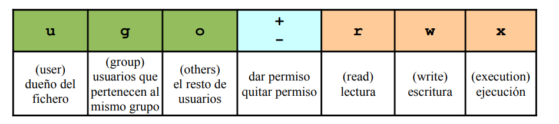

### 4.9 Resumen del cápitulo 4 

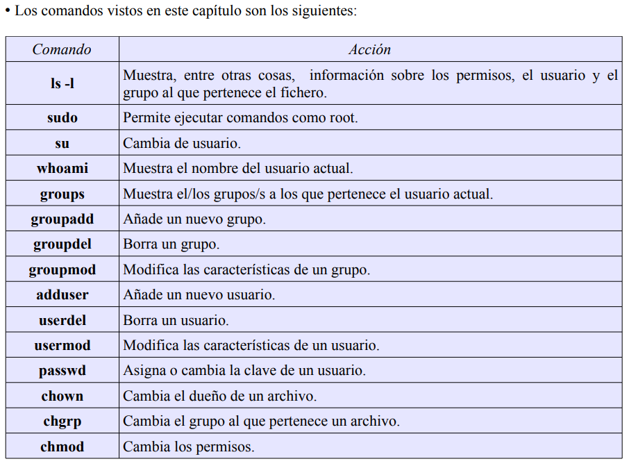

