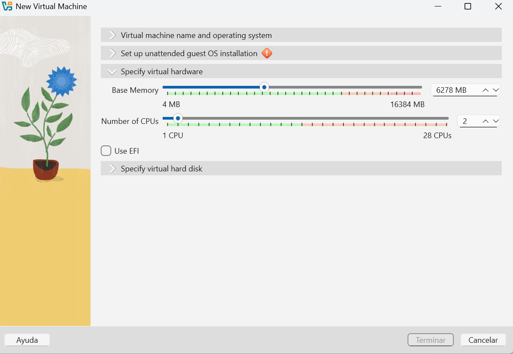
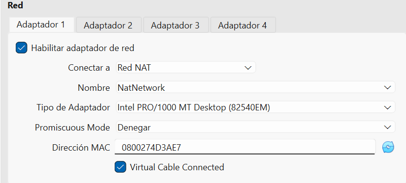
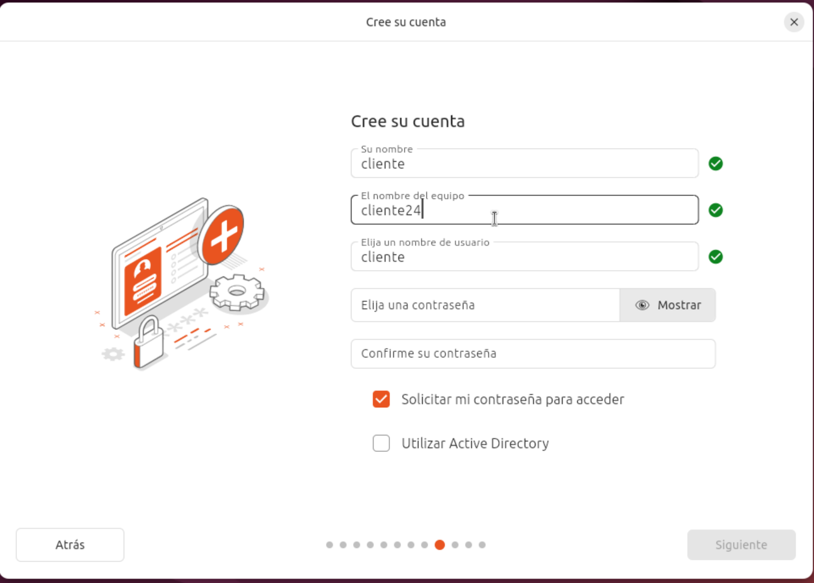

# instalación de la máquina cliente Ubuntu

[TOC]

## Requerimientos de Hardware 

## Creación de la maquina virtual

## Otras cnfiguraciones 

- Deshabilitar audio 
- Escoger Red NAT

## Instalación del sistema operativo 

## instalación de las guest additions 

## Añadir el equipo a Virtualbox

## Exportar servicio virtualizado 

Archivo->Exportar archivo virtualizado

