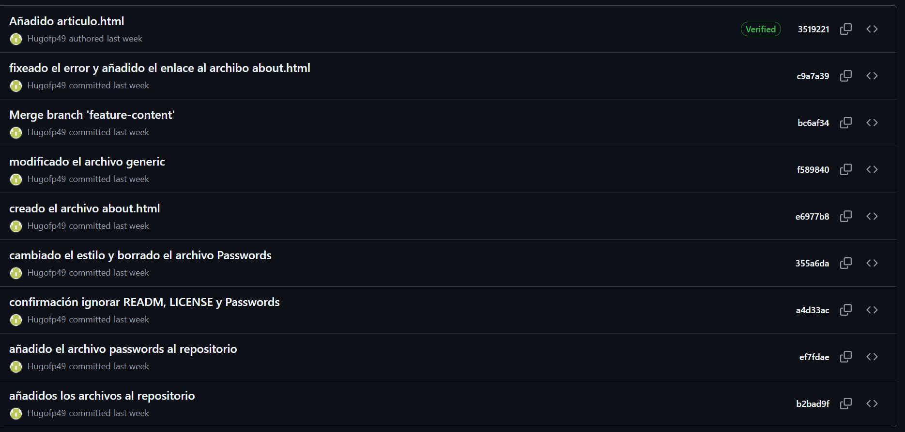
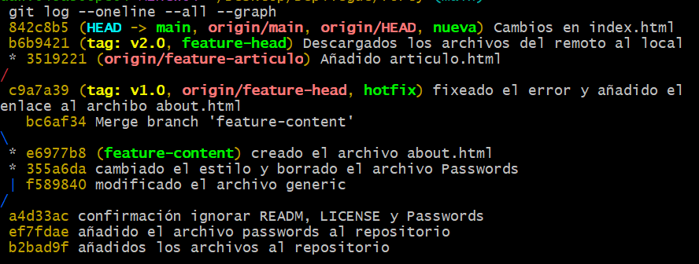
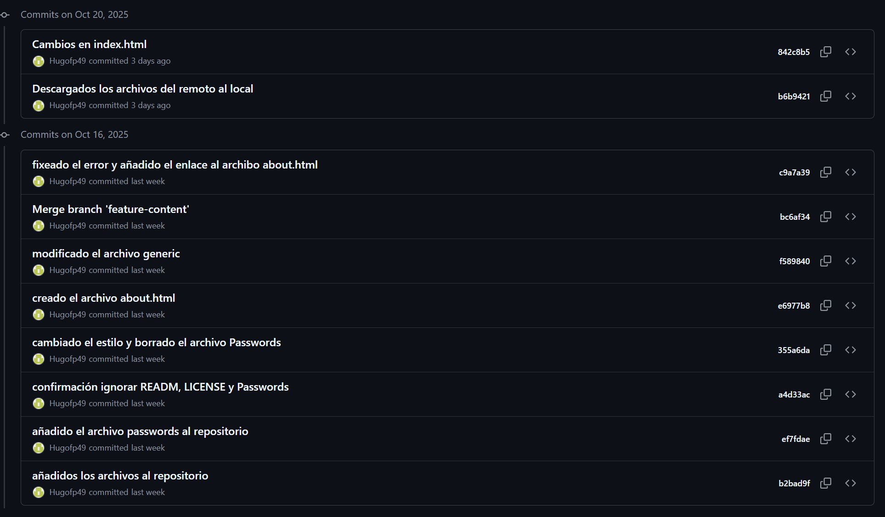
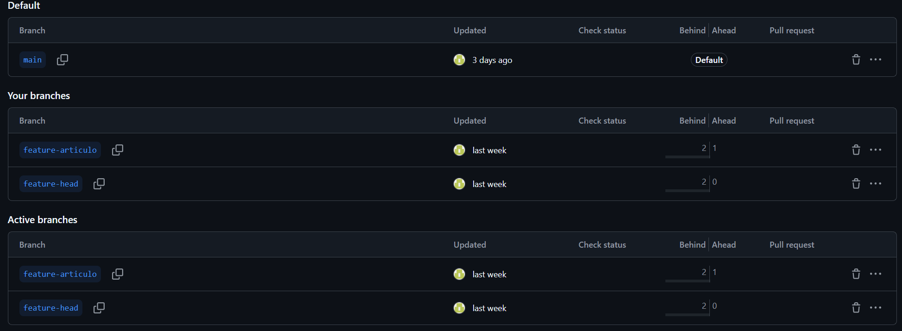
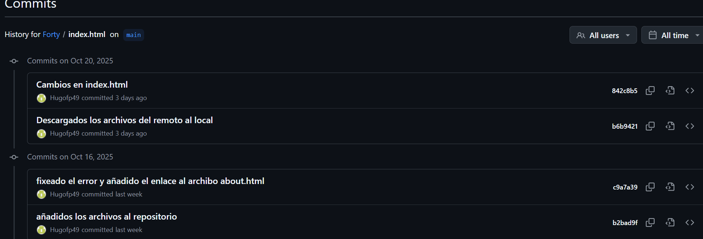

# Ejercicio Forty

[TOC]


## Ejercicio 1

 Inicializa un nuevo repositorio Git en una carpeta llamada "forty" y agrega los archivos proporcionados en el aula virtual.

```bash
git init 
git add .
git commit -m "Añadido el contenido al repositorio"
```

## Ejercicio 2 

Haz que los ficheros README.txt , LICENSE.txt y passwords.txt sean ignorados por el control de versiones.

```bash
git rm --cached LICENSE.txt 
git rm --cached README.txt 
git ls-files --others -i --exclude-standard 
git status 
git commit -m "confirmación ignorar README y LICENSE"
```

## Ejercicio 3 

Crea el archivo passwords.txt. Comprueba que el control de versiones lo ignora.

```bash
 > password.txt
 git status
```

## Ejercicio 4

Crea una rama llamada "feature-content" . Muévete a esa rama. Cambia, en la línea 3477, el font-size por 1.5em en el archivo main.css . Confirma cambios y haz commit. Muestra los logs de la forma más gráfica posible.

```bash
git branch feature-content 
git checkout feature-content
nano ../main.css 
git add .
git commit -m "Actualizados los estilos de la linea 3477 en el archivo main.css"
git log --oneline --graph --all
```

## Ejercico 5 

Elimina el archivo "passwords.txt" en la carpeta forty . Verifica el estado del repositorio. ¿Hay cambios pendientes?

```bash
rm password.txt
git status 
```

No hay cambios ya que hemos configurado el repositorio para que ignore este archivo.

## Ejercicio 6

Crea un nuevo archivo llamado " about.html ", partiendo del archivo generic.html y agrégalo al repositorio, haz un nuevo commit.

```bash
cp about.html generic.html
git commit -m "Creado el archivo about.html"
```

 ## Ejercicio 7

Cambia a la rama main . Examina los logs del repositorio de forma gráfica.

```bash
git checkout main 
git log --oneline --all --graph
```

## Ejercicio 8 

 Modifica algo en el archivo generic.html , comprueba que hay cambios, y realiza otro commit . Examina los logs del repositorio de forma gráfica.

```bash
nano generic.html 
gitt diff HEAD 
git log --oneline --all --graph
```

## Ejercicio 9

Modifica algo en el fichero elements.html . Confirma los cambios, pero no hagas commit.

```bash
nano elements.html
```

## Ejercicio 10 

Mira las diferencias de elements.html . Los cambios no nos gustan, deshaz los cambios de elements.html . Comprueba que no hay cambios pendientes.

```bash
git diff elements.html
git checkout elements.html
git status 
```

## Ejercicio 11

```bash
git diff main..feature-content
```

## Ejercicio 12 

Fusiona la rama "feature-content" con la rama principal (main). Muestra los logs del repositorio de una forma gráfica y completa.

```bash
git merge feature-content
git log --oneline --all --graph
```

## Ejercicio 13 

 Crea una nueva rama llamada " hotfix " y en ella, corrige un error crítico en el archivo " index.html ". 

```bash
git branch hotfix 
git checkout hotfix 
nano index.html
git commit -m "Arreglado error crítico en el archivo index.html"
```

## Ejercicio 14

Fusiona la rama "hotfix" con la rama principal y verifica el historial de commits de forma que se vean todas las ramas gráficamente. ¿Borrarías la rama hotfix ? ¿En qué caso? ¿Cómo?

```bash
git checkout main
git merge hotfix 
git log --oneline --all --graph
git commit -m "fusionada la rama hotfix"
```

No, no borraría la rama hotfix ya que me puede ser útil mas adelante, solo la borraría en caso de haber finalizado mi trabajo con este repositorio, en ese caso lo haría de la siguiente manera.

```bash
git branch -D hotfix
```

## Ejercicio 15

Muestra el historial de cambios limitado a los últimos 3 commits.

```bash
git log --oneline --all --graph -3
```

## Ejercico 16

Etiqueta el commit actual como "v1.0" y muestra las etiquetas existentes

```bash
git tag v1.0
```


# Apartado de trabajo en remoto 

## Ejercicio 1

Sube al remoto los ficheros de tu repositorio local.


## Ejercicio 2 

En local, crea una rama 'feature-head'. Cambia el título en la sección head de index.html , borra los comentarios del head , o previos, también. Confirma y sube los cambios al remoto.


## Ejercicio 3

En remoto, crea una rama 'feature-articulo'. Duplica la página generic , nómbrala como articulo.html , y añade como contenido un artículo sobre Git. Confirma los cambios y realiza un commit. Muestra los commits del repositorio tal como se ven en GitHub.



## Ejercicio 4 

En el repositorio local examina los cambios. Actualiza el repositorio con el remoto. Fusiona en 'main' las dos ramas 'feature'. Crea la etiqueta 'v2.0'. Muestra los logs, commits, etiquetas y ramas actuales, en local y en remoto.






## Ejercicio 5 

En tu copia local, crea una rama nueva . En la rama nueva, cambia los enlaces de la página index.html para que apunten correctamente a la nueva página articulo.html . Confirma los cambios.

```bash
git branch nueva
git checkout nueva 
nano index.html
git add .
```


## Ejercicio 6

Muestra los logs de forma que se vean las ramas en tu copia local.


## Ejercicio 7

 Te gusta el resultado de los cambios. Incorpora los cambios de la rama nueva a la principal.

```bash
git checkout main 
git merge nueva
```

## Ejercicio 8

Sube los cambios al remoto borrando la rama nueva , si es necesario. Comprueba primero con un comando en local, las ramas que hay en el repositorio remoto.



## Ejercicio 9

Muestra en local los cambios en el archivo index.html entre la versión actual y la anterior.

```bash
git diff index.html
```

## Ejercicio 10

 En el repositorio en GitHub, navega hasta el archivo index.html y selecciona la opción "History"



